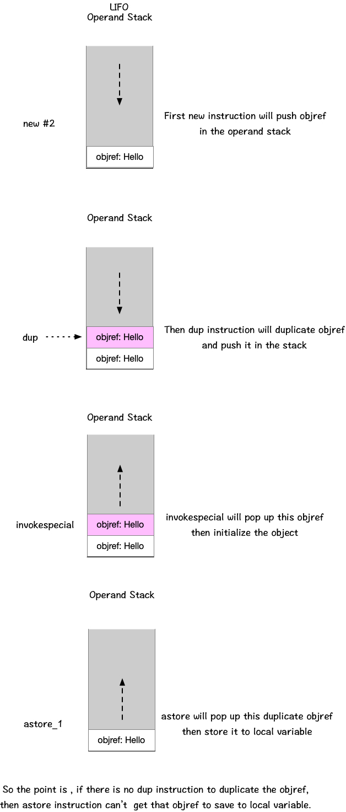
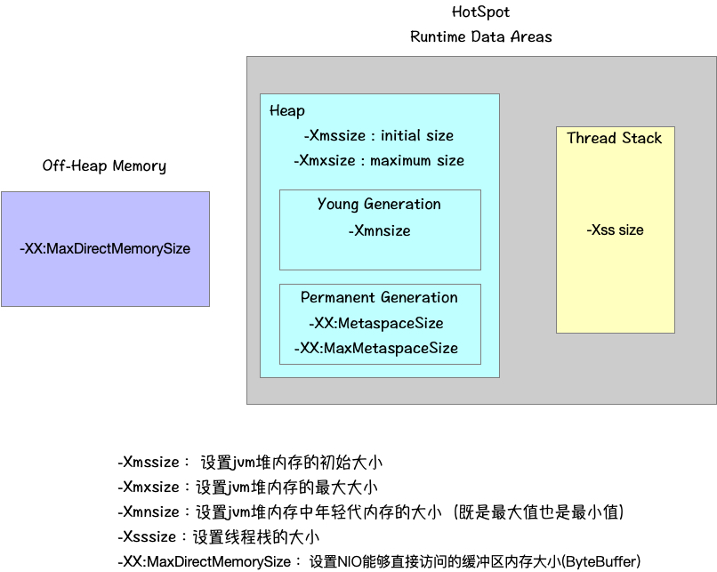

# 学习笔记

## 通过分析jvm指令了解对象创建的过程

首先demo代码如下：

```java
package demo;
public class HelloByteCode {
    public static void main(String[] args) {
        HelloByteCode obj = new HelloByteCode();
    }
}
```

在demo代码编译出的class文件中，main方法部分的执行指令如下：

```text
0: new           #2                  // class demo/HelloByteCode
3: dup
4: invokespecial #3                  // Method "<init>":()V
7: astore_1
8: return
```

除去return部分不解释之外，其他的几个指令，画了一张图以加深理解：



## 作业：画图展示Xmx, Xms, Xmn, Metaspace, DirectMemory,Xss这些内存参数的关系


